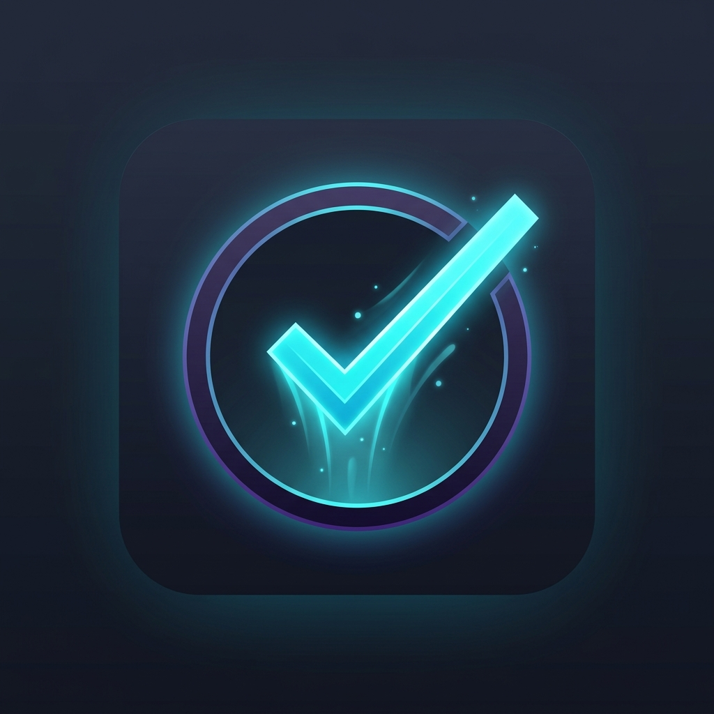
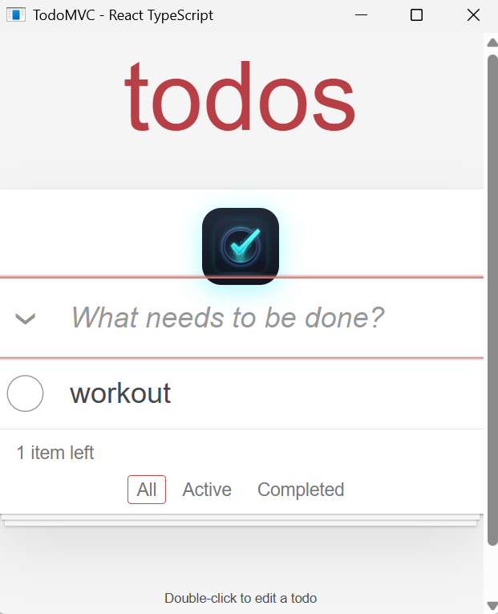

# TodoMVC • React + TypeScript

<p align="center">
  
</p>

<p align="center">
  <strong>A modern, production-grade TodoMVC application implemented in React 18+ and TypeScript.</strong><br />
  <em>Open-source and inspired by <a href="https://github.com/tastejs/todomvc">TasteJS TodoMVC</a> • Built with <strong>Antigravity 2.0</strong></em>
</p>

<p align="center">
  
  
  
  
  
  
</p>

---

## ?? Preview

<p align="center">
  
</p>

---

## ?? Highlights

- **100% Spec Compliant**: Follows the official [TodoMVC Application Specification](https://raw.githubusercontent.com/tastejs/todomvc/refs/heads/master/app-spec.md).
- **Modern React 18+ Hook Architecture**: Uses custom hooks (`useTodos`, `useLocalStorage`, `useHashLocation`) and functional components with strict TypeScript types.
- **Robust State Machine**: Double-click inline editing with Escape-cancel guard, Enter/blur commit, and automatic empty-string deletion.
- **Client-Side Hash Routing**: Native `#/`, `#/active`, and `#/completed` routing.
- **Storage Resilience**: Quota-safe `localStorage` synchronization.
- **Cross-Platform Delivery**: Includes both web SPA and a native Windows Desktop (`TodoMVC.exe`) wrapper using WebView2.
- **Comprehensive Verification**: 296 automated tests across 14 test suites in Vitest + React Testing Library.

---

## ?? Quick Start

### Web Application

1. **Install dependencies**:
   ```bash
   npm install
   ```
2. **Start development server**:
   ```bash
   npm run dev
   ```
3. **Build for production**:
   ```bash
   npm run build
   ```
4. **Run test suite**:
   ```bash
   npm test
   ```

### Windows Desktop Application (`.exe`)

- Double-click `TodoMVC.exe` or `TodoMVC-App.exe` in the root folder, or run:
  ```powershell
  .\TodoMVC.exe
  ```

---

## ?? Project Structure

```text
+-- desktop/               # Windows Desktop wrapper (C# / WebView2)
+-- public/
¦   +-- favicon.svg        # SVG Vector Favicon
¦   +-- icon.jpg           # App Icon
¦   +-- screenshot.png     # Application Preview Screenshot
+-- src/
¦   +-- components/        # UI Components (Header, TodoList, TodoItem, Footer, InfoFooter)
¦   +-- hooks/             # Domain Hooks (useTodos, useLocalStorage, useHashLocation)
¦   +-- styles/            # Official TodoMVC CSS styles
¦   +-- types/             # TypeScript definitions
¦   +-- App.tsx            # Root Application Component
¦   +-- main.tsx           # React DOM Entry
+-- tests/                 # Comprehensive 14-suite Vitest test battery (296 tests)
+-- TodoMVC.exe            # Standalone Windows Desktop Executable
+-- screenshot.png         # Preview Image
+-- README.md
```

---

## ?? Attribution & License

- **Inspiration**: [TasteJS TodoMVC](https://github.com/tastejs/todomvc)
- **Built with**: [Google Antigravity 2.0](https://github.com/)
- **License**: Released under the open-source [MIT License](./LICENSE).
